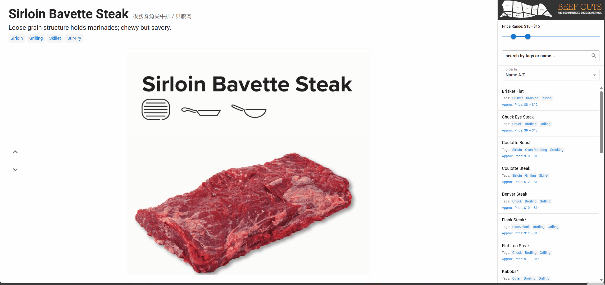
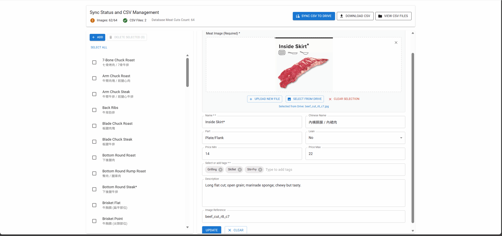

# Meat Cut App

A full-stack application for browsing and managing beef cuts with detailed information, search capabilities, and Google Drive API integration for image storage/usage/update/sync and maintain datasets unique.

## Demo

### frontend


### frontend admin



## Table of Contents

- [Features](#features)
- [Technology Stack](#technology-stack)
- [Project Structure](#project-structure)
- [Setup Instructions](#setup-instructions)
  - [Prerequisites](#prerequisites)
  - [Backend Setup](#backend-setup)
  - [Frontend Setup](#frontend-setup)
  - [Environment Variables](#environment-variables)
  - [Google Drive Configuration](#google-drive-configuration)
- [Database Schema](#database-schema)
- [API Documentation](#api-documentation)
- [Scripts](#scripts)
- [Development](#development)
- [Production Build](#production-build)
- [Troubleshooting](#troubleshooting)

## Features

### Public Features
- **Browse Meat Cuts**: View detailed information about different beef cuts
- **Search & Filter**: Search by name (English or Chinese) and filter by price range, part, lean status, and cooking methods
- **Sort Options**: Sort by Name, Cut, Cooking Method, or Price
- **Image Navigation**: Navigate through images with keyboard arrows
- **Detailed Information**: View cooking methods, cut type, tags, descriptions, and price ranges

### Admin Features
- **CRUD Operations**: Create, read, update, and delete meat cuts
- **Image Management**: Upload, update, and manage images via Google Drive
- **CSV Import/Export**: Import data from CSV files and export database to CSV
- **Google Drive Sync**: Sync CSV files and images with Google Drive
- **Bulk Operations**: Delete multiple meat cuts at once
- **Authentication**: Simple token-based authentication for admin routes

## Technology Stack

### Backend
- **Node.js** (ES Modules)
- **Express.js** - Web framework
- **SQLite** (better-sqlite3) - Database
- **Google APIs** (googleapis) - Google Drive integration
- **Multer** - File upload handling
- **CSV Parser** - CSV file processing

### Frontend
- **React 18** - UI library
- **TypeScript** - Type safety
- **Material-UI (MUI)** - Component library
- **React Router** - Navigation
- **Vite** - Build tool and dev server
- **Axios** - HTTP client
- **PapaParse** - CSV parsing (legacy support)

## Project Structure

```
meat_cut_app/
├── backend/
│   ├── config/
│   │   ├── database.js          # Database configuration
│   │   └── googleDrive.js       # Google Drive client setup
│   ├── data/
│   │   └── meat_cuts.db         # SQLite database (generated)
│   ├── middleware/
│   │   ├── auth.js              # Authentication middleware
│   │   └── errorHandler.js      # Error handling middleware
│   ├── migrations/
│   │   └── init.sql             # Database schema initialization
│   ├── models/
│   │   ├── MeatCut.js           # Meat cut model
│   │   ├── CookingMethod.js     # Cooking method model
│   │   └── RecommendedDish.js   # Recommended dish model
│   ├── routes/
│   │   ├── public.js            # Public API routes
│   │   └── admin.js             # Admin API routes
│   ├── scripts/
│   │   ├── syncToGoogleDrive.js # Sync database to Drive
│   │   ├── uploadExistingImages.js # Upload local images
│   │   └── ...                  # Other utility scripts
│   ├── services/
│   │   ├── googleDriveService.js # Google Drive service
│   │   └── searchService.js     # Search and filter service
│   ├── utils/
│   │   ├── csvImporter.js       # CSV import utilities
│   │   ├── csvExporter.js       # CSV export utilities
│   │   ├── slugGenerator.js     # Slug generation
│   │   └── validators.js        # Validation utilities
│   ├── server.js                # Express server entry point
│   └── package.json             # Backend dependencies
├── frontend/
│   ├── src/
│   │   ├── api/
│   │   │   ├── client.ts        # API client configuration
│   │   │   └── admin.ts         # Admin API functions
│   │   ├── components/
│   │   │   ├── MeatCutDetail.tsx # Main detail view
│   │   │   └── Sidebar.tsx      # Search, filters, results list
│   │   ├── pages/
│   │   │   ├── Admin.tsx        # Admin interface
│   │   │   └── AdminLogin.tsx   # Admin login page
│   │   ├── utils/
│   │   │   ├── csvParser.ts     # CSV parsing (legacy)
│   │   │   └── filters.ts       # Filtering and sorting
│   │   ├── App.tsx              # Main application component
│   │   ├── main.tsx             # Application entry point
│   │   └── types.ts             # TypeScript type definitions
│   ├── public/
│   │   └── data/                # Static data files
│   └── package.json             # Frontend dependencies
├── data/
│   ├── beefcut_init_database.csv # Initial CSV data
│   └── beef_cuts_images/        # Local image files
└── README.md                     # This file
```

## Setup Instructions

### Prerequisites

- **Node.js** (v18 or higher)
- **npm** or **yarn** package manager
- **Google Cloud Project** with Drive API enabled (for Google Drive features)
- **Google Service Account** credentials JSON file

### Backend Setup

1. **Navigate to backend directory:**
   ```bash
   cd backend
   ```

2. **Install dependencies:**
   ```bash
   npm install
   # or
   yarn install
   ```

3. **Place Google Service Account credentials:**
   - Place your Google service account JSON key file in the `backend/` directory
   - Name it `meat-buyer-guide-39a5081fce50-key.json` (or update the path in `.env`)

4. **Create `.env` file** (see [Environment Variables](#environment-variables) section)

5. **Initialize database:**
   - The database will be automatically initialized on first server start
   - If the database is empty, it will import data from `data/beefcut_init_database.csv`

6. **Start the server:**
   ```bash
   npm start
   # or for development with auto-reload
   npm run dev
   ```

   The backend server will run on `http://localhost:5000` (or the port specified in `.env`)

### Frontend Setup

1. **Navigate to frontend directory:**
   ```bash
   cd frontend
   ```

2. **Install dependencies:**
   ```bash
   npm install
   # or
   yarn install
   ```

3. **Create `.env` file** (optional):
   ```env
   VITE_API_BASE_URL=http://localhost:5000/api
   ```

4. **Start development server:**
   ```bash
   npm run dev
   ```

   The frontend will run on `http://localhost:3000` (or the port specified in `vite.config.ts`)

5. **Copy data folder** (if using local CSV/images):
   ```bash
   # Windows PowerShell
   Copy-Item -Path "../data" -Destination "public/data" -Recurse -Force
   ```

### Environment Variables

#### Backend (.env in `backend/` directory)

```env
# Server Configuration
PORT=5000
NODE_ENV=development

# Database
DB_PATH=./data/meat_cuts.db

# Google Drive Configuration
GOOGLE_APPLICATION_CREDENTIALS=./meat-buyer-guide-39a5081fce50-key.json
GOOGLE_DRIVE_BASE_FOLDER_NAME=meat-cut-app
GOOGLE_DRIVE_BASE_FOLDER_ID=
GOOGLE_DRIVE_IMAGES_FOLDER_NAME=Images
GOOGLE_DRIVE_IMAGES_FOLDER_ID=
GOOGLE_DRIVE_CSV_FOLDER_NAME=CSV
GOOGLE_DRIVE_CSV_FOLDER_ID=

# Admin Authentication
ADMIN_USERNAME=admin
ADMIN_PASSWORD=admin
ADMIN_API_KEY=

# Frontend URL (for share links)
FRONTEND_URL=http://localhost:3000
```

#### Frontend (.env in `frontend/` directory)

```env
VITE_API_BASE_URL=http://localhost:5000/api
```

### Google Drive Configuration

1. **Create a Google Cloud Project:**
   - Go to [Google Cloud Console](https://console.cloud.google.com/)
   - Create a new project or select an existing one

2. **Enable Google Drive API:**
   - Navigate to "APIs & Services" > "Library"
   - Search for "Google Drive API" and enable it

3. **Create a Service Account:**
   - Go to "APIs & Services" > "Credentials"
   - Click "Create Credentials" > "Service Account"
   - Create the service account and download the JSON key file

4. **Share Google Drive Folders:**
   - Create folders in Google Drive for images and CSV files
   - Share these folders with the service account email (found in the JSON key file)
   - Copy the folder IDs from the URLs and add them to `.env`

5. **Place credentials:**
   - Save the JSON key file as `meat-buyer-guide-XXXXXXXX.json` in the `backend/` directory
   - Or update `GOOGLE_APPLICATION_CREDENTIALS` in `.env` with the correct path

## Database Schema

### Tables

#### `meat_cuts`
Main table storing meat cut information.

| Column | Type | Description |
|--------|------|-------------|
| id | INTEGER | Primary key |
| name | TEXT | English name |
| chinese_name | TEXT | Chinese name |
| part | TEXT | Cut part/category |
| lean | BOOLEAN | Is lean meat |
| price_min | REAL | Minimum price |
| price_max | REAL | Maximum price |
| price_mean | REAL | Average price |
| price_display | TEXT | Formatted price display |
| texture_notes | TEXT | Texture and notes |
| image_reference | TEXT | Image reference string |
| google_drive_image_id | TEXT | Google Drive file ID |
| google_drive_image_url | TEXT | Google Drive image URL |
| slug | TEXT | URL-friendly identifier (unique) |
| created_at | DATETIME | Creation timestamp |
| updated_at | DATETIME | Last update timestamp |

#### `cooking_methods`
Cooking methods catalog.

| Column | Type | Description |
|--------|------|-------------|
| id | INTEGER | Primary key |
| name | TEXT | Cooking method name (unique) |
| created_at | DATETIME | Creation timestamp |

#### `recommended_dishes`
Recommended dishes catalog.

| Column | Type | Description |
|--------|------|-------------|
| id | INTEGER | Primary key |
| name | TEXT | Dish name (unique) |
| created_at | DATETIME | Creation timestamp |

#### Junction Tables
- `meat_cut_cooking_methods` - Links meat cuts to cooking methods
- `meat_cut_recommended_dishes` - Links meat cuts to recommended dishes

#### `metadata`
System metadata storage.

| Column | Type | Description |
|--------|------|-------------|
| key | TEXT | Metadata key (primary key) |
| value | TEXT | Metadata value |
| updated_at | DATETIME | Last update timestamp |

## API Documentation

### Base URL
```
http://localhost:5000/api
```

### Public Endpoints

#### `GET /api/health`
Health check endpoint.

**Response:**
```json
{
  "status": "ok",
  "timestamp": "2024-01-01T00:00:00.000Z"
}
```

#### `GET /api/metadata`
Get system metadata.

**Response:**
```json
{
  "lastUpdate": "2024-01-01T00:00:00.000Z",
  "totalMeatCuts": 100,
  "version": "1.0.0"
}
```

#### `GET /api/meat-cuts/search`
Search and filter meat cuts.

**Query Parameters:**
- `q` (string, optional): Search query
- `priceMin` (number, optional): Minimum price
- `priceMax` (number, optional): Maximum price
- `part` (string, optional): Filter by part
- `lean` (boolean, optional): Filter by lean status
- `cookingMethod` (string, optional): Filter by cooking method

**Response:**
```json
{
  "results": [
    {
      "id": 1,
      "name": "Arm Chuck Roast",
      "chineseName": "臂部肩胛肉",
      "part": "Chuck",
      "lean": true,
      "priceRange": {
        "min": 6,
        "max": 9,
        "mean": 7.5,
        "display": "$6 – $9"
      },
      "cookingMethods": ["Braising", "Roasting"],
      "recommendedDishes": ["Pot Roast"],
      "textureNotes": "...",
      "imageUrl": "/api/drive/image/FILE_ID",
      "slug": "arm-chuck-roast"
    }
  ],
  "total": 100,
  "priceRange": {
    "min": 5,
    "max": 50
  }
}
```

#### `GET /api/meat-cuts/:slug`
Get a single meat cut by slug.

**Response:**
```json
{
  "id": 1,
  "name": "Arm Chuck Roast",
  "chineseName": "臂部肩胛肉",
  "cookingMethods": ["Braising", "Roasting"],
  "recommendedDishes": ["Pot Roast"],
  "imageUrl": "/api/drive/image/FILE_ID",
  "shareUrl": "http://localhost:3000/meat/arm-chuck-roast"
}
```

#### `GET /api/drive/image/:id`
Proxy an image from Google Drive.

**Response:** Image file (binary)

#### `GET /api/filters/options`
Get all available filter options.

**Response:**
```json
{
  "parts": ["Chuck", "Rib", "Loin"],
  "cookingMethods": ["Braising", "Roasting", "Grilling"],
  "priceRange": {
    "min": 5,
    "max": 50
  }
}
```

### Admin Endpoints

All admin endpoints require authentication via `X-API-Key` header or `apiKey` query parameter.

#### `POST /api/admin/login`
Admin login.

**Request Body:**
```json
{
  "username": "admin",
  "password": "admin"
}
```

**Response:**
```json
{
  "success": true,
  "token": "base64_encoded_token",
  "message": "Login successful"
}
```

#### `GET /api/admin/meat-cuts`
List all meat cuts (paginated).

**Query Parameters:**
- `page` (number, default: 1)
- `limit` (number, default: 20)
- `orderBy` (string, default: "name")

#### `GET /api/admin/meat-cuts/:id`
Get a single meat cut by ID.

#### `POST /api/admin/meat-cuts`
Create a new meat cut.

**Request:** `multipart/form-data`
- `name` (string, required)
- `chineseName` (string, required)
- `part` (string, required)
- `lean` (boolean, required)
- `priceMin` (number, required)
- `priceMax` (number, required)
- `textureNotes` (string, optional)
- `imageReference` (string, required)
- `cookingMethods` (array/string, optional)
- `recommendedDishes` (array/string, optional)
- `imageFile` (file, optional)
- `googleDriveImageId` (string, optional)

#### `PUT /api/admin/meat-cuts/:id`
Update a meat cut.

**Request:** Same as POST

#### `DELETE /api/admin/meat-cuts/:id`
Delete a meat cut.

#### `POST /api/admin/meat-cuts/bulk-delete`
Delete multiple meat cuts.

**Request Body:**
```json
{
  "ids": [1, 2, 3]
}
```

#### `GET /api/admin/drive/images`
List all images in Google Drive.

#### `POST /api/admin/drive/image`
Upload an image to Google Drive.

**Request:** `multipart/form-data`
- `imageFile` (file, required)
- `fileName` (string, optional)

#### `GET /api/admin/export/csv`
Export all meat cuts to CSV (download).

#### `POST /api/admin/sync/csv-to-drive`
Export database to CSV and upload to Google Drive.

#### `GET /api/admin/sync/status`
Get synchronization status between database and Google Drive.

For complete API documentation, see the route files in `backend/routes/`.

## Scripts

### Backend Scripts

Located in `backend/scripts/`:

- `syncToGoogleDrive.js` - Sync database to Google Drive CSV
- `syncDatabaseFromDriveCSV.js` - Import data from Google Drive CSV
- `uploadExistingImages.js` - Upload local images to Google Drive
- `fillGoogleDriveImageIds.js` - Fill Google Drive image IDs in database
- `testGoogleDrive.js` - Test Google Drive connection

**Run scripts:**
```bash
cd backend
npm run sync:drive
npm run upload:images
npm run fill:image-ids
npm run sync:db-from-drive
```

### Frontend Scripts

```bash
npm run dev      # Start development server
npm run build    # Build for production
npm run preview  # Preview production build
npm run lint     # Run ESLint
```

## Development

### Database Initialization

The database is automatically initialized on first server start. The initialization script:
1. Creates all tables and indexes
2. Checks if the database is empty
3. If empty, imports data from `data/beefcut_init_database.csv`

### Adding New Meat Cuts

1. **Via Admin Interface:**
   - Log in at `/admin/login`
   - Navigate to the admin panel
   - Click "Add New Meat Cut"
   - Fill in the form and upload an image

2. **Via CSV Import:**
   - Prepare a CSV file with the required columns
   - Use the admin interface to upload or sync

3. **Via API:**
   - Use `POST /api/admin/meat-cuts` endpoint
   - Include authentication token

### Image Management

Images are stored in Google Drive. When uploading:
1. Image is uploaded to the configured Google Drive folder
2. File ID and URL are stored in the database
3. Images are served via the `/api/drive/image/:id` endpoint

### CSV Format

CSV files should include the following columns:
- `ID` (optional, auto-generated)
- `Name` (required)
- `Chinese Name` (required)
- `Part` (required)
- `Lean` (required: "Yes" or "No")
- `Approx. Price` (required: format like "$6 – $9")
- `Texture & Notes` (optional)
- `image reference` (required)
- `Rec. Cooking Methods` (optional, comma-separated)
- `Recommended Dishes` (optional, comma-separated)
- `Google Drive Image ID` (optional)
- `Google Drive Image URL` (optional)

## Production Build

### Backend

1. Set `NODE_ENV=production` in `.env`
2. Ensure all environment variables are configured
3. Start the server:
   ```bash
   npm start
   ```

### Frontend

1. Build the application:
   ```bash
   cd frontend
   npm run build
   ```

2. The built files will be in `frontend/dist/`

3. Serve the `dist/` folder with a web server (nginx, Apache, etc.)

4. Configure the web server to proxy API requests to the backend:
   ```
   /api/* → http://localhost:5000/api/*
   ```

## Troubleshooting

### Database Issues

- **Database file not found**: Ensure the `data/` directory exists and is writable
- **Migration errors**: Delete the database file and restart the server to reinitialize
- **Foreign key errors**: Ensure all related records exist before creating associations

### Google Drive Issues

- **Authentication errors**: Verify the service account JSON file is correct and placed in the right location
- **Permission errors**: Ensure the service account email has access to the Drive folders
- **API not enabled**: Verify Google Drive API is enabled in Google Cloud Console

### Frontend Issues

- **API connection errors**: Check that `VITE_API_BASE_URL` is correct and the backend is running
- **Images not loading**: Verify Google Drive image IDs are set in the database
- **CORS errors**: Ensure CORS is properly configured in the backend (currently allows all origins in development)

### Common Solutions

1. **Clear and reinitialize database:**
   ```bash
   cd backend
   rm data/meat_cuts.db
   npm start
   ```

2. **Reinstall dependencies:**
   ```bash
   rm -rf node_modules
   npm install
   ```

3. **Check environment variables:**
   - Verify all required environment variables are set
   - Check for typos in variable names

4. **Check logs:**
   - Backend logs appear in the console
   - Check browser console for frontend errors

## The Image data are extracted from pdf from:
https://www.beefitswhatsfordinner.com/cuts/cut-charts


